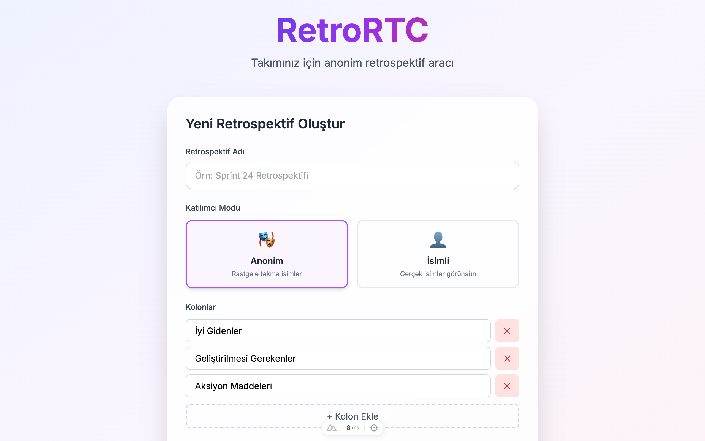

<p align="center">
  <h1 align="center">🎯 RetroRTC</h1>
  <p align="center">
    <strong>Serverless, Privacy-First Retrospective Tool</strong><br>
    <em>Sunucusuz, Gizlilik Odaklı Retrospektif Aracı</em>
  </p>
</p>

<p align="center">
  
  
  
  
  
</p>

<p align="center">
  
</p>

---

[🇺🇸 English](#-english) | [🇹🇷 Türkçe](#-türkçe)

---

## 🇺🇸 English

### 📜 Manifesto

> **"Your ideas are yours. Your data should be too."**

RetroRTC is designed to let teams run their retrospective meetings freely. A tool that prioritizes privacy, supports multiple synchronization methods, and doesn't require central servers, third-party services, or registration forms.

#### Why RetroRTC?

- 🔒 **Privacy First**: No data is sent to our servers by default. P2P modes allow data to live only in participants' browsers.
- 🎭 **Anonymous Participation**: Share your ideas freely with fun nicknames like "Cosmic Panda 42" or "Ninja Unicorn 7".
- ⚡ **Zero Setup**: No registration, no downloads, no configuration. Just share a link and start.
- 🌐 **Flexible Sync**: Choose between **WebRTC (P2P)**, **Trystero (BitTorrent)**, or **Supabase (Realtime)** based on your network needs.
- 💾 **Full Control**: Retrospective data stays in your browser. Delete or export anytime you want.

---

### ✨ Features

| Feature | Description |
|---------|-------------|
| 🔄 **Multi-Provider Sync** | Support for PeerJS, Trystero (BitTorrent), and Supabase Realtime |
| 🌍 **Multi-Language** | Native support for English and Turkish |
| 🎭 **Anonymous/Named Mode** | Choose participation mode based on team preference |
| 📝 **Customizable Columns** | Default or custom column names |
| 🎨 **Colorful Post-it Notes** | 8 different pastel color options |
| ❤️ **Like System** | Vote on notes to highlight important ideas |
| 🎬 **Presentation Mode** | Special view for presenting retro results |
| 📥 **Markdown Export** | Export results in `.md` format |
| 👥 **Participant Tracking** | View connected participants and their roles |

---

### 🎮 How It Works?

```
┌─────────────────────────────────────────────────────────────────┐
│                      RETROSPECTIVE FLOW                         │
└─────────────────────────────────────────────────────────────────┘

  1️⃣ CREATE                2️⃣ SHARE                3️⃣ JOIN
  ┌─────────┐              ┌─────────┐             ┌─────────┐
  │  Host   │    Link      │  Team   │   Click    │  Join   │
  │ Creates │ ──────────▶  │ Members │ ─────────▶ │   As    │
  │  Retro  │              │         │            │  Guest  │
  └─────────┘              └─────────┘             └─────────┘
       │                                                │
       │                                                │
       ▼                                                ▼
  ┌─────────────────────────────────────────────────────────┐
  │                  4️⃣ START THE RETRO!                     │
  │                                                         │
  │  ┌──────────┐  ┌──────────────┐  ┌──────────────────┐  │
  │  │ What     │  │ What Could   │  │ Action           │  │
  │  │ Went     │  │ Be           │  │ Items            │  │
  │  │ Well     │  │ Improved     │  │                  │  │
  │  │ 📝 Note 1│  │ 📝 Note 3    │  │ 📝 Note 5        │  │
  │  │ 📝 Note 2│  │ 📝 Note 4    │  │ 📝 Note 6        │  │
  │  └──────────┘  └──────────────┘  └──────────────────┘  │
  └─────────────────────────────────────────────────────────┘
                              │
                              ▼
                    5️⃣ EXPORT (Markdown)
```

#### Step by Step Usage

1. **Create a Retrospective**
   - Fill out the "Create New Retrospective" form on the home page.
   - Enter a retrospective name.
   - Choose default language (TR/EN).
   - Select **Sync Provider**:
     - **PeerJS / Trystero**: Best for open networks (P2P).
     - **Supabase**: Best for restrictive networks (VPNs/Firewalls). You can provide your own Supabase credentials!
   - Customize columns.

2. **Share the Link**
   - Share the unique generated link with team members.

3. **Add Notes & Discuss**
   - Add notes, edit them, and vote on others' ideas.
   - Everything syncs in real-time.

4. **Export Results**
   - Download the board as a Markdown file.

---

### 🛠 Tech Stack

| Technology | Version | Description |
|------------|---------|-------------|
| [Nuxt](https://nuxt.com) | 3.x | Vue meta-framework |
| [Vue](https://vuejs.org) | 3.x | Reactive UI framework |
| [PeerJS](https://peerjs.com) | 1.5.x | WebRTC abstraction layer |
| [Trystero](https://github.com/dmotz/trystero) | 0.x | WebRTC over BitTorrent/IPFS |
| [Supabase](https://supabase.com) | 2.x | Realtime Sync Provider (Optional) |
| [TailwindCSS](https://tailwindcss.com) | 3.x | Utility-first CSS |

---

### 🚀 Installation & Running

#### Requirements
- Node.js 18+ 
- npm, pnpm, yarn, or bun

#### Development

```bash
# Install dependencies
npm install

# Start development server (http://localhost:3000)
npm run dev
```

#### Production Build

```bash
# Create production build
npm run build

# Preview build
npm run preview
```

---

## 🇹🇷 Türkçe

### 📜 Manifesto

> **"Fikirleriniz sizin. Verileriniz de sizin olmalı."**

RetroRTC, takımların retrospektif toplantılarını özgürce yapabilmesi için tasarlandı. Gizliliği ön planda tutan, farklı senkronizasyon yöntemlerini destekleyen, merkezi sunuculara veya kayıtlara ihtiyaç duymayan bir araç.

#### Neden RetroRTC?

- 🔒 **Gizlilik Öncelikli**: Varsayılan olarak sunucularımıza veri gönderilmez. P2P modları verilerin sadece tarayıcıda kalmasını sağlar.
- 🎭 **Anonim Katılım**: "Kozmik Panda 42" gibi eğlenceli takma isimlerle fikirlerinizi özgürce paylaşın.
- ⚡ **Sıfır Kurulum**: Kayıt yok, indirme yok. Sadece link paylaşın ve başlayın.
- 🌐 **Esnek Senkronizasyon**: Ağ durumunuza göre **WebRTC (P2P)**, **Trystero (BitTorrent)** veya **Supabase (Realtime)** seçebilirsiniz.
- 💾 **Tam Kontrol**: Veriler tarayıcınızda kalır. İstediğiniz zaman silin, dışa aktarın.

---

### ✨ Özellikler

| Özellik | Açıklama |
|---------|----------|
| 🔄 **Çoklu Senkronizasyon** | PeerJS, Trystero (BitTorrent) ve Supabase Realtime desteği |
| 🌍 **Çoklu Dil** | Türkçe ve İngilizce yerel dil desteği |
| 🎭 **Anonim/İsimli Mod** | Takım tercihine göre katılım modu seçimi |
| 📝 **Özelleştirilebilir Kolonlar** | Varsayılan veya özel kolon isimleri |
| 🎨 **Renkli Post-it Notları** | 8 farklı pastel renk seçeneği |
| ❤️ **Beğeni Sistemi** | Notlara oy vererek önemli fikirleri öne çıkarın |
| 🎬 **Sunum Modu** | Retrospektif sonuçlarını sunmak için özel görünüm |
| 📥 **Markdown Export** | Sonuçları `.md` formatında dışa aktarın |
| 👥 **Katılımcı Takibi** | Bağlı katılımcıları ve rolleri görüntüleyin |

---

### 🎮 Nasıl Çalışır?

```
┌─────────────────────────────────────────────────────────────────┐
│                        RETROSPEKTİF AKIŞI                       │
└─────────────────────────────────────────────────────────────────┘

  1️⃣ OLUŞTUR                2️⃣ PAYLAŞ               3️⃣ KATIL
  ┌─────────┐              ┌─────────┐             ┌─────────┐
  │  Host   │    Link      │ Takım   │   Tıkla    │  Guest  │
  │ Retro   │ ──────────▶  │ Üyeleri │ ─────────▶ │  Olarak │
  │ Oluştur │              │   İle   │            │  Katıl  │
  └─────────┘              └─────────┘             └─────────┘
       │                                                │
       │                                                │
       ▼                                                ▼
  ┌─────────────────────────────────────────────────────────┐
  │                   4️⃣ RETRO BAŞLASIN!                     │
  │                                                         │
  │  ┌──────────┐  ┌──────────────┐  ┌──────────────────┐  │
  │  │ İyi      │  │ Geliştirilmesi│  │ Aksiyon         │  │
  │  │ Gidenler │  │ Gerekenler    │  │ Maddeleri       │  │
  │  │          │  │               │  │                 │  │
  │  │ 📝 Not 1 │  │ 📝 Not 3      │  │ 📝 Not 5        │  │
  │  │ 📝 Not 2 │  │ 📝 Not 4      │  │ 📝 Not 6        │  │
  │  └──────────┘  └──────────────┘  └──────────────────┘  │
  └─────────────────────────────────────────────────────────┘
                              │
                              ▼
                    5️⃣ EXPORT AL (Markdown)
```

#### Adım Adım Kullanım

1. **Retrospektif Oluştur**
   - Ana sayfadaki formu doldurun.
   - Dil seçiminizi yapın (TR/EN).
   - **Bağlantı Yöntemi** seçin:
     - **PeerJS / Trystero**: Açık ağlar için ideal (P2P).
     - **Supabase**: Kısıtlı ağlar (VPN/Güvenlik Duvarı) için ideal. Kendi Supabase bilgilerinizi girebilirsiniz!
   - Kolonları özelleştirin.

2. **Linki Paylaş**
   - Oluşturulan linki takımla paylaşın.

3. **Notlar Ekle & Tartış**
   - Not ekleyin, düzenleyin, oylayın.
   - Her şey anlık senkronize olur.

4. **Sonuçları Dışa Aktar**
   - Markdown formatında indirin.

---

### 🛠 Teknoloji Stack

| Teknoloji | Versiyon | Açıklama |
|-----------|----------|----------|
| [Nuxt](https://nuxt.com) | 3.x | Vue meta-framework |
| [Vue](https://vuejs.org) | 3.x | Reaktif UI framework |
| [PeerJS](https://peerjs.com) | 1.5.x | WebRTC soyutlama katmanı |
| [Trystero](https://github.com/dmotz/trystero) | 0.x | BitTorrent/IPFS üzerinden WebRTC |
| [Supabase](https://supabase.com) | 2.x | Realtime Senkronizasyon (Opsiyonel) |
| [TailwindCSS](https://tailwindcss.com) | 3.x | Utility-first CSS |

---

### 🚀 Kurulum ve Çalıştırma

#### Gereksinimler
- Node.js 18+ 
- npm, pnpm, yarn veya bun

#### Geliştirme Ortamı

```bash
# Bağımlılıkları yükle
npm install

# Geliştirme sunucusunu başlat (http://localhost:3000)
npm run dev
```

#### Production Build

```bash
# Production build oluştur
npm run build

# Build'i önizle
npm run preview
```

---

## 🤝 Contributing / Katkıda Bulunma

1. Fork the repository
2. Create your feature branch (`git checkout -b feature/amazing-feature`)
3. Commit your changes (`git commit -m 'feat: add amazing feature'`)
4. Push to the branch (`git push origin feature/amazing-feature`)
5. Open a Pull Request

---

## 📄 License / Lisans

This project is licensed under the MIT License.
Bu proje MIT lisansı altında lisanslanmıştır.

---

<p align="center">
  <strong>🎯 RetroRTC</strong><br>
  <em>Your data is yours, your ideas are free.</em><br>
  <em>Verileriniz sizin, fikirleriniz özgür.</em>
</p>
